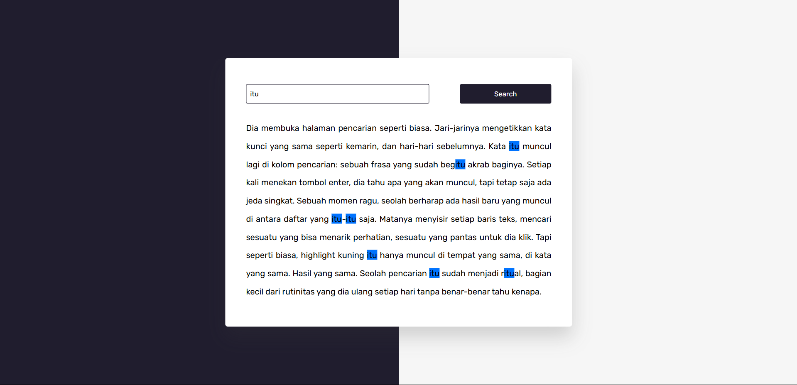

# 💻 JavaScript Practice Projects

Kumpulan mini project JavaScript  untuk latihan dan eksplorasi fitur dasar DOM, CSS, dan logika pemrograman interaktif.

---

## 🌐 Halaman Utama

Buka halaman utama: [disini](https://mufacoderz.github.io/Javascript-Practice-Project/)

---

## 📦 Daftar Project

### 📝 Random Quote Generator
  

---

### 🔢 Calculator
  

---

### 🎨 Color Picker
  

---

### ⏳ Countdown Timer
  

---

### 🎯 Number Guessing Game
  

---

### 🖊📝 Notes App
 

---

### ⛅ Weather App
 

---

### 🌏 Info negara
 

---

### 🎮 Scissor Paper Stone Game
 

---

### 🍙 Anime Finder
 

---

### 🖊️ Highlight Searched Text
 

