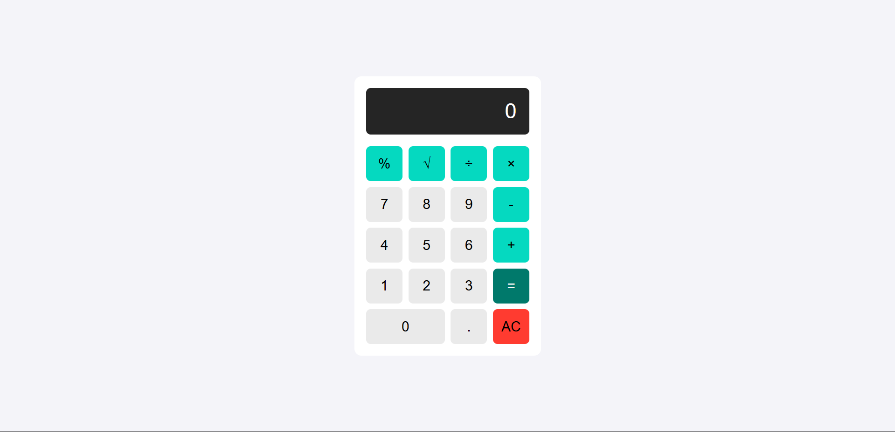

# 💻 JavaScript Practice Projects

Kumpulan mini project JavaScript  untuk latihan dan eksplorasi fitur dasar DOM, CSS, dan logika pemrograman interaktif.

---

## 🌐 Halaman Utama

Buka halaman utama: [Index Page](https://mufacoderz.github.io/Javascript-Practice-Project/)

---

## 📦 Daftar Project

### 📝 Random Quote Generator
  
🔗 [Lihat Project](projects/Random%20Quote%20Generator/index.html)

---

### 🔢 Calculator
  
🔗 [Lihat Project](projects/Calculator/index.html)

---

### 🎨 Color Picker
  
🔗 [Lihat Project](projects/Color%20Picker/index.html)

---

### ⏳ Countdown Timer
  
🔗 [Lihat Project](projects/Countdown%20Timer/index.html)

---

### 🎯 Number Guessing Game
  
🔗 [Lihat Project](projects/Number%20Guessing/index.html)

---

### 🖌️ Paint App
❌ **Belum ada preview**  
🔗 [Lihat Project](projects/Paint%20App/index.html)

---

### 📸 Carrousel Image Slider
❌ **Belum ada preview**  
🔗 [Lihat Project](projects/Carrousel%20Image%20Slider/index.html)

---

## 🚀 Cara Menjalankan

1. Clone repo ini
2. Buka `index.html` di browser
3. Klik salah satu project untuk mencobanya

---

## 🛠️ Stack yang Digunakan
- HTML
- CSS
- JavaScript DOM

---

